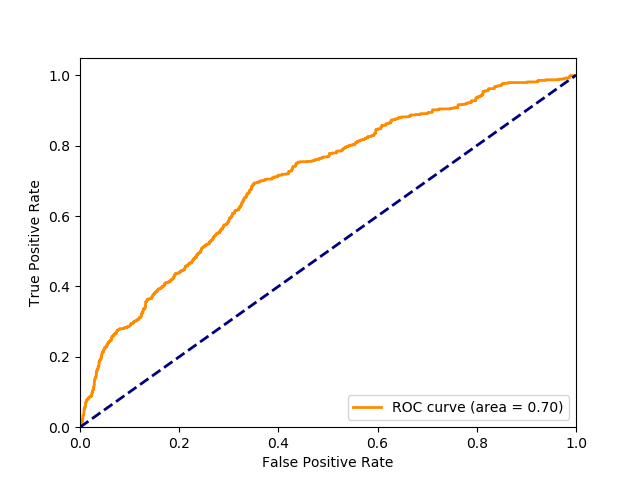

# AnomalyDetectionCVPR2018-Pytorch
Pytorch version of - https://github.com/WaqasSultani/AnomalyDetectionCVPR2018

## Download C3D weights
I couldn't upload here the weights for the C3D model because the files is too big, but it can be easily found, `google c3d pytorch```

## Features extraction
```python feature_extractor.py --dataset_path "path-to-dataset" --annotation_path "path-to-train-annos" --annotation_path_test "path-to-test-annos" --pretrained_3d "path-to-pretrained-c3d"```

## Training
```python TrainingAnomalyDetector_public.py --features_path "path-to-dataset" --annotation_path "path-to-train-annos" --annotation_path_test "path-to-test-annos"```

## Generate ROC curve
```python generate_ROC.py --features_path "path-to-dataset" --annotation_path "path-to-annos"```


